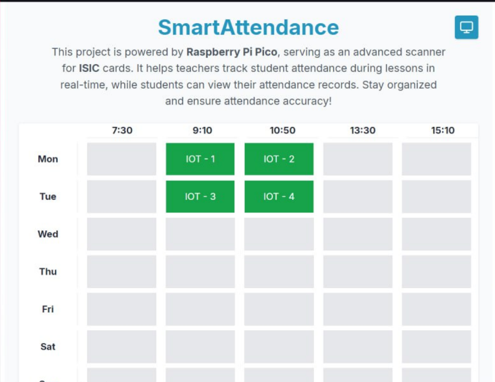
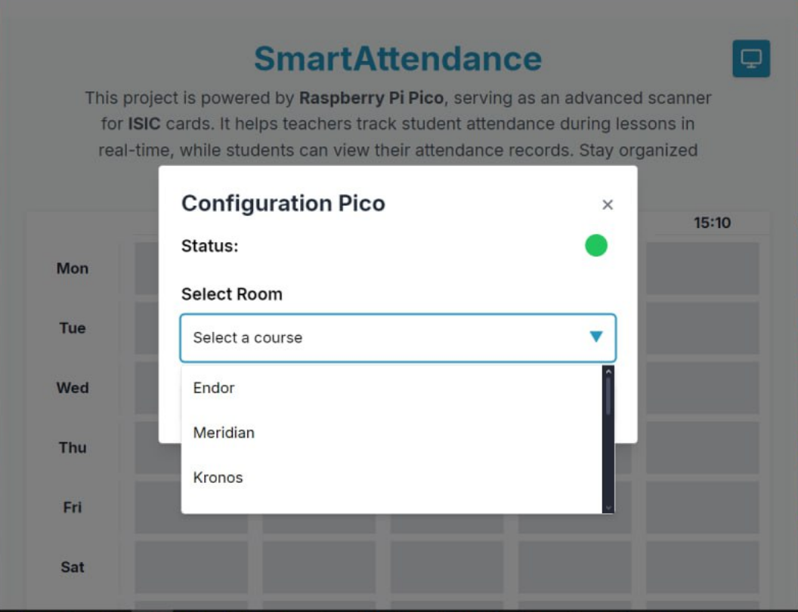
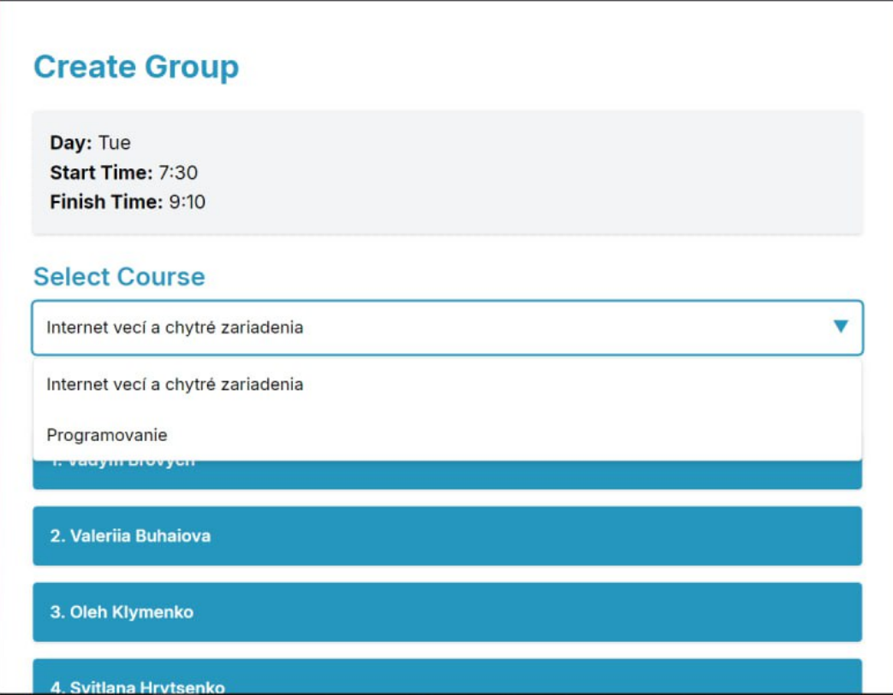
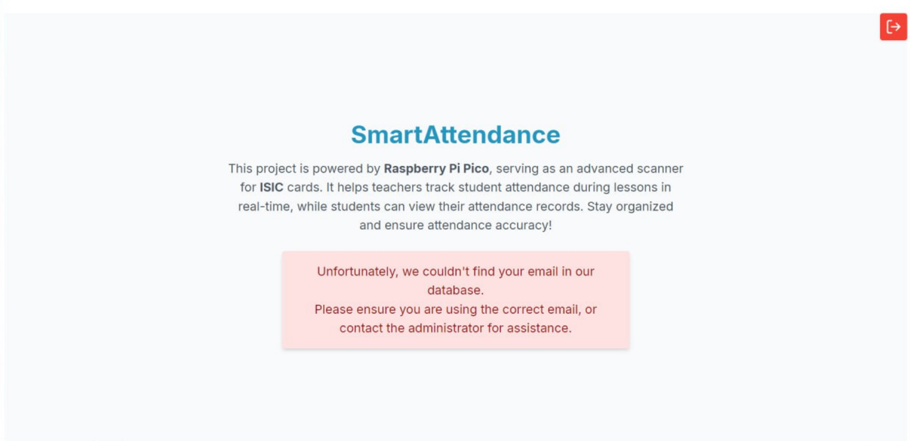

# 🎓 SmartAttendance – ISIC-Powered Attendance System with Custom IoT Device

**SmartAttendance** is a real-time, full-stack attendance tracking system for classrooms — powered by **Raspberry Pi Pico W**, **ISIC card scanning**, and **FastAPI + React**.

The project combines a **custom-built IoT device** with a modern dashboard to allow teachers to manage lessons and groups, while students can track their own presence. No QR codes, no manual entry — just tap your card.

Powered by **MQTT**, the system is lightning fast, extensible, and fully offline-capable when needed.

---

## ⚙️ Tech Stack

| Layer          | Technology                            |
|----------------|----------------------------------------|
| **Device**     | Raspberry Pi Pico W + MFRC522 (RFID)   |
| **Protocol**   | MQTT over Wi-Fi (via `umqtt.simple`)   |
| **Backend**    | FastAPI + SQLAlchemy + SQLite          |
| **Frontend**   | React + TypeScript + Tailwind CSS      |
| **State Logic**| Finite State Machine (FSM) on device   |
| **Auth**       | JWT token-based authentication         |
| **Comm Layer** | Mosquitto / MQTT Broker (local/LAN)    |

---

## ✨ Key Features

- 🪪 **ISIC Tap-to-Scan** – Track attendance instantly via RFID tap
- 📶 **MQTT Protocol** – Fast, reliable, real-time messaging between device and backend
- ⚡ **Standalone Mode** – Device works even without backend (caches locally, syncs later)
- 🧠 **Finite State Engine** – Pico device runs a full FSM to handle config, errors, reset & more
- 🖥️ **Dashboard for Teachers** – Manage groups, lessons, and history with ease
- 👨‍🎓 **Student Portal** – Students can view their own records anytime
- 🧪 **OLED + LEDs + Buzzer** – Clear, immediate feedback on each scan
- 🔐 **Secure & Encrypted** – Tokenized backend and optional local encryption for device config

---

### 📷 Configuration Instructions

> Here's how the setup flow looks like on device startup:

<table>
  <tr>
    <td><strong>Device Configuration Guide</strong></td>
    <td><strong>Device</strong></td>
  </tr>
  <tr>
    <td></td>
    <td></td>
  </tr>
</table>

---

## 🛠️ Device Setup Guide

To set up the device for the first time:

1. Power it on via USB or power adapter.
2. Wait for the **yellow LED** to appear — it indicates Access Point (AP) mode.
3. Connect your phone or laptop to Wi-Fi:  
   **SSID**: `PicoConfig`  
   **Password**: `1234567`

4. Go to `http://192.168.4.1` and follow the steps.
5. Enter:
   - Your Wi-Fi credentials
   - MQTT broker address (if applicable)
   - Backend server endpoint

---


## 🖼️ UI Screenshots

| Group Schedule | Device Configuration | Create Group | Error Message |
|----------------|----------------------|--------------|----------------|
|  |  |  |  |

> Web interface built with Tailwind + React, tested for teachers and students.

---

## 🔌 Installation & Usage

### 🧠 Backend (FastAPI)

```bash
cd backend
pip install -r requirements.txt
uvicorn src.main:app --reload
````

Runs on: `http://localhost:8000`

### 💻 Frontend (React + Vite)

```bash
cd frontend
npm install
npm run dev
```

Runs on: `http://localhost:5173`

---

## 🔐 Environment Variables

Create a `.env` file in `/backend/`:

```
API_SECRET=your-jwt-secret
MQTT_HOST=localhost
MQTT_PORT=1883
DEVICE_PASSWORD=your-optional-device-key
```

Or use `docker-compose.yml` for containerized startup.

---

## 📡 Communication Flow

```plaintext
[Student taps card]
     ↓ (RFID UID)
[Pico reads UID + timestamp]
     ↓ (via MQTT)
[MQTT broker (Mosquitto)]
     ↓ (payload JSON)
[FastAPI backend parses → stores in SQLite]
     ↓
[Frontend fetches data over REST API]
```

✅ Real-time
📦 Reliable
🔁 Works offline & syncs when online

---

## 📜 License

This project is open-source under the **MIT License**.

---

## 👤 Authors

- [Vadym Brovych](mailto:vadmabos.programming@gmail.com)
- [Valeriia Buhaiova](mailto:valeriia.buhaiova@student.tuke.sk)

🗓️ Original development: Jan 2025

